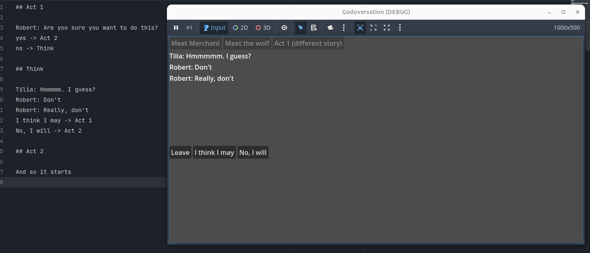

#  Godoversation

> A DSL to describe conversations

Godoversation is a thin wrapper over signals allowing you to write conversations ergonomically, using GDScript. Because you use full GDScript, you do not need any specific plugin or wiring to tap into your game's systems: simply load or emit the resources you want.

Godoversation is unopinionated, and doesn't show any UI by default. All it does it emit signals. You're free to use those signals in any way you prefer: for example, displaying the conversation in a UI; or triggering game events.

The repo has an example project.

Because conversation needs are often very specific to games, it might be surprising to know that there will be no API to extend the functionality: rather, it is expected that you add your own functionality to Godoversation. The code _is itself_ the API, and it is kept _intentionally_ as simple as possible. Change it, adapt it, publish your own variations, or use it as inspiration for something different.

## Example Usage:

```gdscript
class_name MyConversation extends Conversation

var sophia := Actor.Make("Sophia", preload("res://assets/sophia.png"))

func start() -> void:
	actor(sophia)
	say("Hey!")
	say("How are you?")
	if visits(start) > 0:
		say("I've asked you this %s times before" % [visits(start)])
	choice("I'm fine", _fine)
	choice("I'm not fine", _not_fine)
	leave_choice("I don't want to talk")

func _fine() -> void:
	say("That's good to hear!")
	leave_choice("Yep! Goodbye!")

func _not_fine() -> void:
	say("That's too bad.")
	say("I'll ask again, ok?")
	choice("Ok", start)
	leave_choice("No. I'm leaving")
```

Then start the conversation with `conversation.godot(start)`. This will start emitting signals. Here is a very simple example that only prints the conversation to the console:

```gdscript
func _ready() -> void:
	var conversation := MyConversation .new()
	conversation.conversation_started.connect(_on_conversation_started)
	conversation.quit_request.connect(_on_conversation_quit)
	conversation.godot(start)


func _on_conversation_started() -> void:
	for node in _conversation.current_nodes:
	for line in node.lines:
		print(line)
		for choice in node.choices:
			var button := choice.make_button()


func _on_conversation_ended() -> void:
	print("finished")
```

There is no way to make choices in this example, since the buttons aren't used anywhere.

The way Godoversation works is simple and inspired by the talk 
[Narrative Sorcery: Coherent Storytelling in an Open World](https://www.youtube.com/watch?v=HZft_U4Fc-U&t=544s) by Inkle's Jon Ingold at GDC 2017.

Every function is a "node". Visiting the node increases it's `visit` count. To know if a player has encountered an event before, you can count the number of visits to a specific node. This system isn't confined to conversations either. A node can be any method, and do anything.

To show how simple it is to add new functionality to this kind of code, there's an example of a simple parser for a text format too


